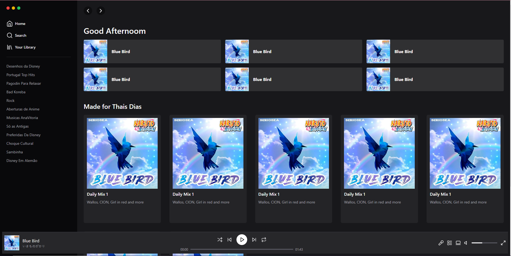

# Spotify Interface Clone

This project is a clone of the Spotify interface built with Next.js, TypeScript, and Tailwind CSS. It is designed to be fully responsive and currently includes a functional play button.

## Features

-   **Responsive Design**: The interface adjusts smoothly to different screen sizes, maintaining a good user experience across devices.
-   **Play Button Functionality**: Users can interact with the play button to simulate playing a track.

## Technologies

-   [Next.js](https://nextjs.org/)
-   [TypeScript](https://www.typescriptlang.org/)
-   [Tailwind CSS](https://tailwindcss.com/)

## Live Demo

Check out the live version of the project here: [Spotify Interface Clone on Vercel](https://interface-spotify-umber.vercel.app/)

